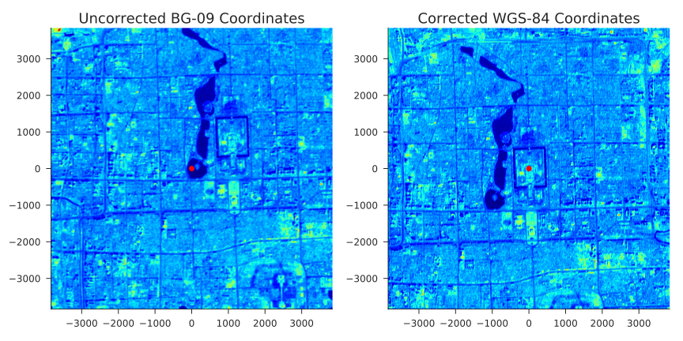

#! Geographic Clustering of Firms in China

Douglas Hanley (University of Pittburgh)
Chengying Luo (University of Pittburgh)
Mingqin Wu (South China Normal University)

# Introduction

The spatial arrangement of firms is known to be a critical factor influencing a variety of firm level outcomes. Numerous existing studies have investigated the importance of firm density and localization at various spatial scales, as well as agglomeration by industry. In this paper, we bring relatively new data and techniques to bear on the issue.

Regarding the data, we use a comprehensive census of firms conducted by the National Bureau of Statistics of China (NBS). This covers firms in all industries and localities, and we have waves from both 2004 and 2008 available. Past studies have largely relied on manufacturing firms This additional data allows us to look more closely at clustering within services, as well as potential spillovers between services and manufacturing. Further, by looking at the case of China, we get a snapshot of a country (especially in the early 2000s) in a period of rapid transition, but one that has already industrialized to a considerable degree. Additionally, this is an environment shaped by far more aggressive industrial policies than those seen in much of Western Europe and North America.

In terms of techniques, we take a machine learning approach to understanding firm clustering and agglomeration. Specifically, we use images generated by density maps of firm location data (from the NBS data) as well as linked satellite imagery from the Landsat 7 spacecraft. This allows us to frame the issue as one of prediction. By predicting firm outcomes such as profitability, productivity, and growth using these images, we can understand their relationship to firm clustering. By turning this into a prediction problem using images as inputs, we can tap into the rich and rapidly evolving literature in computer science and machine learning on deep convolutional neural networks (CNN). Additionally, we can utilize software and hardware tools developed for this purpose.

# Data Overview

Our firm data comes from the periodic survey of firms conducted by the Chinese NBS. In our case, we have waves from both 2004 and 2008. The 2004 wave constitutes roughly 1.5M firms, while the 2008 wave has considerably more with about 7.1M firms. For each firm we see a variety of aggregated statistics such as income and number of employees, the four digit industry in which they operate, their ownership structure (private or state-owned), amongst many others.

We also are given the address of the headquarters ^[In most cases this is a specific street address, but in some cases in is only the township, which is nonetheless rather specific.]. In the vast majority of cases where firms have a single establishment or plant, this address is the firms only operating location. Using this information, we are able to obtain the longitude and latitude for each firm to within about 100 meters. One issue is that these are given in the BD-09 coordinate system, which is based on the GCJ-02 coordinate system, both of which are designed to intentionally obfuscate the exact location of given coordinates by applying a pseudo-random mapping to the true location ^[See [here](https://en.wikipedia.org/wiki/Restrictions_on_geographic_data_in_China) for more details]. Fortunately, there are existing fixed-point algorithms that can reliably invert these mappings with minimal impact on the resulting location accuracy.

@! [bd_wgs_compare] Accuracy of uncorrected BD-09 versus corrected WGS-84 coordinates using a highly recognizable structure, the central pavilion of the Forbidden City in Beijing (distances in meters).

As can be seen in @[bd_wgs_compare], the accuracy loss from using uncorrected coordinates is on the order of 500 meters. This can be a substantial error when attempting to understand the importance of clustering in extremely dense areas such as that pictured above (central Beijing).

In addition to firm level data from the NBS, we also have linked patent data from the Chinese State Intellectual Property Office (SIPO). This data can be thought of as roughly comparable to patent data in the US context, although we do not currently have information on patent citations, making it impossible to compute citation weighted metrics. Thus we rely purely on patent counts and information on the technology class (IPC) that are filed under. We do not currently use the abstract text for this project ^[See Hanley and Luo (2018) for such an example in the clean technology space.].

Finally, we employ satellite imagery to bring in additional information about the nature and structure of the environment in which the firms are operating. The most widely available public satellite data for this time period is that from Landsat 7, which is operated by the US Geographical Survey (USGS). Launched in 1999 and still operating today, it provides global coverage at 15 meter resolution in a variety of visible and non-visible frequencies. Unfortunately, an partial instrument failure in 2003 caused imagery produced thereafter to suffer from substantially lower quality. Thus, we only use data from 2003 or earlier and focus on the 2004 wave of firms data. @[landsat_demo] displays satellite imagery at various radii for a firm located in Shanghai.

@! [landsat_demo] Landsat 7 imagery centered on Shanghai Happy Vacuum Cleaner Factory. Dark patches are areas of cloud cover.

The Landsat 7 imagery is generally fairly high quality. The major challenge is obtaining uniformly cloud-free coverage. Major providers like Google generally stitch together many sources for land locations (though less so for water locations). In our setting, we attempt to choose images with less than 20% cloud coverage within a range of a few months. However, since images are provided in cells of 100 kilometers on a side, it is not feasible to push this threshhold any lower without losing uniform land coverage.

# Techniques

There are a wide variety of ways that cities and firms can be laid out. This including gridding patterns, geographic features like rivers, technology parks, and industrial zones. Some of this is partly determined by nature or decisions made long ago, while certain features are a product of contemporaneous decisions by governments or firms. Pictured in @[density_overlay] are maps of firm density in two cities of note: Shanghai and Xi'an.

@! [density_overlay] Firm density at 15 meter cell resolution overlaid on satellite imagery of Shanghai (left) and Xi'an (right). Note the different distance scales.

Shanghai is, of course, notably larger in terms of population and area, though it is also quite a bit more dense with firms. The former is also distinguished by its division in two by the Huangpu River, though Xi'an itself is heavily influenced by its ancient city wall that surround core of roughly 1.5 by 2 kilometers. Another notable feature seen in the southwest quadrant of the firm density overlay is the Xi'an Hi-tech Industrial Development Zone.

Various methods have been developed to measure and quantify firm *clustering* (how they are arranged geographically, particularly at high density) and *agglomeration* (their tendency to group together by industry). Notable for agglomeration are those developed by Ellison and Glaeser (1997) and Holmes and Stevens (2002), as well as the more recent example of Duranton and Overman (2004). Clustering is often characterized by some localized measure of density.

However, such aggregated measures discard much of the micro-structure of the rich, high-dimensional data we are drawing from. To address this, we propose taking advantage of recent advanced in deep learning motivated primarily by computer vision applications. The inputs are similar, namely two-dimensional maps and images, and the goal remains prediction. In the case, we don't wish to predict, say the identity or class of the object being depicted, but rather some outcome of the firm at the center of a particular map, such as productivity, profitability, patenting rate, or revenue growth.

One of the major challenges with such an approach is that much the information present the maps above, for instance the distance to the city core, are in fact proxies for other existing features such as industry. Thus the task is not to predict unconditional features, but to predict residuals left over after controlling for known factors. An alternative to this approach would also be to incorporate such features into a unified analysis and let the optimization algorithm sort out the proper weights.

# Implementation

Our chosen approach is to utilize a deep convolutional neural network (CNN) to predict residual firm profitability and firm growth after having partialed out such standard controls industry and firm age. CNNs have proven extremely effective at the task of image classification. Widely available databases of hand-labeled images have spurred heavy competition, and approaches such as those seen with AlexNet or Inception-v3 have yielded impressive results. Meanwhile, the development of less expensive, high powered GPUs has greatly expanded the scope of solvable problems. On top of this, the development of easier-to-use libraries such as Tensorflow (Google) and Torch (Facebook) has made such undertakings both easier and open to a wider class of researchers and practictioners.

For comparison, ImageNet has over 14M images in its database, while our dataset has 1.4M firms in 2004 and roughly 7.1M firms in 2008. Thus it is reasonable to think we could utilize models of similar or slightly smaller complexity. The application is of course slightly different in terms of the nature of the images at hand, so this is somewhat speculative at this stage. Recent approaches have included a technique known as transfer learning, wherein large, general classifiers are pretrained at industrial scale (generally by large technology companies such as Google), and are then tweaked on specific datasets for more specialized usages. This approach, while certainly useful, would be less applicable in this case, as the image domain is quite different from that of generic image classification.

# Results

TBD